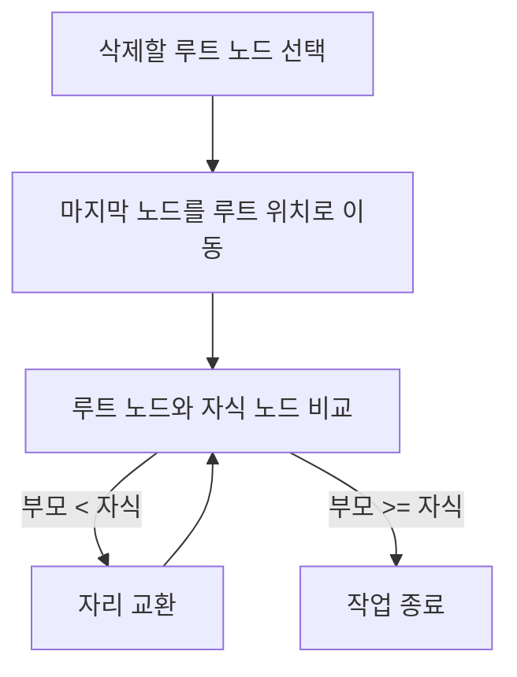

# 힙 삭제 연산 (Delete Max in Max-Heap)

힙에서 **가장 큰 키(루트 노드)를 삭제**하는 과정입니다.

---

## 개념

* **루트 노드(최대값)를 삭제**한다.
* 힙의 **마지막 노드**를 루트 위치로 옮긴다.
* 루트에서부터 자식 노드들과 비교하며 힙 성질을 만족하도록 내려가며 교환한다.

---

## 과정 예시

초기 최대 힙:

```
        9
      /   \
     7     5
    / \   / \
   3   4 2   1
```

1. 루트 `9`를 삭제 → 마지막 노드 `3`을 루트로 이동

```
        3
      /   \
     7     5
    / \   / 
   3   4 2   
```

2. 루트 `3`과 자식 `7`, `5` 중 큰 값인 `7`과 교환

```
        7
      /   \
     3     5
    / \   / 
   3   4 2   
```

3. 다시 `3`과 자식 `4` 비교 → `4`가 크므로 교환

```
        7
      /   \
     4     5
    / \   / 
   3   3 2   
```

4. 힙 성질 만족 → 작업 종료

---

## 동작 흐름



---

## 시간 복잡도

* 트리 높이가 `log n`이므로, 삭제 연산도 `O(log n)` 시간 소요

---

# 힙 정렬 (Heap Sort)

힙 자료구조를 이용해 배열을 정렬하는 방법입니다.

---

## 힙 정렬 과정

1. **배열 → 힙 구성**
   주어진 배열을 최대 힙 형태로 재구성

2. **정렬 시작**
   루트(최대값)와 배열 마지막 원소 교환 → 힙 크기 1 감소 → 힙 재구성 (Heapify)

3. 이 과정을 반복 → 정렬된 배열 완성

---

## 예시

정렬할 배열:

```
[23, 56, 11, 99, 27, 34, 2, 3]
```

1. 배열을 최대 힙으로 재구성

```
        99
      /    \
    56      34
   /  \    /  \
  27  23  2    3
 /
11
```

2. 루트 `99`와 마지막 원소 `3` 교환 → 힙 크기 감소 → 힙 재구성

3. 재구성 후 최대 힙:

```
        56
      /    \
    27      34
   /  \    /  
  23  3  2   
 /
11
```

4. 위 과정을 반복하며 배열은 다음과 같이 정렬됩니다.

---

## 시간 복잡도

* 전체 정렬 시간: `O(n log n)`

---

# 머신 스케줄링 (LPT 알고리즘)

여러 대의 기계에 작업을 분배할 때, **작업 시간이 긴 작업을 우선적으로 할당하는 알고리즘**입니다.

---

## 개념

* 작업들을 길이 순서대로 정렬
* 작업 시간이 가장 긴 것을 먼저 빈 기계에 할당
* 작업 종료 시간이 가장 짧은 기계를 찾아 다음 작업을 할당

---

## 예시

작업 시간: `[8, 7, 6, 5, 3, 2, 1]`
기계 3대: M1, M2, M3

| 기계 | 할당 작업 및 시간 | 총 작업 시간 |
| -- | ---------- | ------- |
| M1 | 8, 3       | 11      |
| M2 | 7, 2       | 9       |
| M3 | 6, 5, 1    | 12      |

* 작업 순서대로 가장 짧은 작업 시간 기계에 작업 할당

---

## 작업 분배 흐름

```mermaid
flowchart TD
    A[작업 리스트 정렬 (긴 작업 우선)] --> B[가장 짧은 종료 시간 기계 선택]
    B --> C[작업 할당]
    C --> D{남은 작업 있나?}
    D -->|예| B
    D -->|아니오| E[종료]
```

---

# 허프만 코드 (Huffman Coding)

문자 빈도를 기반으로 효율적인 가변 길이 코드를 생성하는 압축 알고리즘입니다.

---

## 특징

* 빈도가 높은 문자는 짧은 코드 할당
* 빈도가 낮은 문자는 긴 코드 할당
* 전체 메모리 사용량 절감

---

## 예시

| 문자 | 빈도 | 허프만 코드 |
| -- | -- | ------ |
| E  | 20 | 0      |
| P  | 10 | 101    |
| M  | 5  | 1001   |
| Y  | 3  | 10001  |
| S  | 2  | 10000  |

---

## 허프만 트리 예시

```
          (*)
         /    \
       E(20)  (*)
             /    \
           P(10)   (*)
                   /    \
                 M(5)   (*)
                       /   \
                     Y(3)   S(2)
```

* 빈도가 낮은 문자일수록 트리 깊이가 깊어져 긴 코드 부여

---

## 비교: ASCII 코드 vs 허프만 코드

| 구분       | 코드 길이      | 비고              |
| -------- | ---------- | --------------- |
| ASCII 코드 | 고정 7\~8 비트 | 간단하지만 비효율적      |
| 허프만 코드   | 가변 길이      | 데이터 특성에 최적화된 압축 |

---
