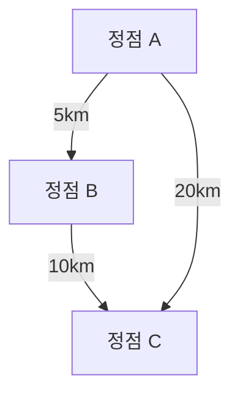

# 문자 코드와 허프만 코드

## 1. 문자 코드 방식

컴퓨터는 문자를 비트로 표현합니다. 대표적인 코드 방식 두 가지는:

| 코드 종류    | 비트 구성                               | 특징            |
| -------- | ----------------------------------- | ------------- |
| ASCII 코드 | 7비트 (실제로 8비트 중 1비트는 페리티, 3비트는 존 비트) | 범용적, 고정 길이 코드 |
| EBCDIC   | 8비트 (상위 4비트는 존 비트, 하위 4비트는 디지털 비트)  | IBM 계열에서 사용   |

* **존 비트**: 문자 코드 영역 구분
* **디지털 비트**: 문자 식별을 위한 위치 정보

---

## 2. 허프만 코드(Huffman Coding)

문자 빈도에 따라 가변 길이 비트 코드를 할당하는 압축 방식입니다.

### 예시 문자 5개: E, T, N, I, S

| 문자 | 빈도수 | 허프만 코드 (예) |
| -- | --- | ---------- |
| E  | 15  | 00         |
| T  | 7   | 01         |
| N  | 6   | 11         |
| I  | 4   | 100        |
| S  | 2   | 101        |

### 허프만 트리 구조 (빈도 합산 및 노드 병합 과정)

```
         (34)
        /    \
     (15)     (19)
     E        /  \
           (7)  (12)
           T    /  \
               N   (5)
                   / \
                  I   S
```

* 왼쪽 자식: '1' 부여
* 오른쪽 자식: '0' 부여
* 위 트리에서 E는 '00', T는 '01', N은 '11' 등 코드 생성

---

## 3. 저장 비트 수 계산 예

* ASCII: 고정 3비트 × 45글자 = 135비트
* 허프만: 빈도×코드 길이 합 = 88비트 → 효율적 저장 가능

---

# 그래프 이론 기초

## 1. 그래프란?

* 정점(Vertex, Node): 객체
* 간선(Edge, Link): 정점 간 연결 관계

### 그래프 표현

* 무방향 그래프: 간선에 방향 없음 (양방향 가능)
* 방향 그래프: 간선에 방향 있음 (일방통행)

---

## 2. 그래프 예시

### 무방향 그래프

```
정점: {0, 1, 2, 3}

간선: {(0,1), (0,2), (0,3), (1,2), (2,3)}
```

```
   1
  / \
 0---2
  \  |
    3
```

### 방향 그래프

```
정점: {0, 1, 2, 3}

간선: {0→1, 0→3, 1→2, 2→3, 3→1}
```

---

## 3. 그래프 용어

* **차수(Degree)**: 한 정점에 연결된 간선의 개수

  * 무방향 그래프: 차수 = 연결된 간선 수
  * 방향 그래프:

    * 진입차수 = 들어오는 간선 수
    * 진출차수 = 나가는 간선 수

---

## 4. 경로와 사이클

* **경로(Path)**: 정점들의 나열로, 인접한 정점끼리 간선으로 연결됨
* **단순 경로(Simple Path)**: 반복되는 간선 없이 연결된 경로
* **사이클(Cycle)**: 시작 정점과 종료 정점이 같은 경로

---

## 5. 그래프의 종류

| 종류      | 설명                   | 예시                        |
| ------- | -------------------- | ------------------------- |
| 연결 그래프  | 모든 정점 쌍에 경로가 존재      | 모든 정점이 서로 연결됨             |
| 비연결 그래프 | 일부 정점 쌍에 경로가 존재하지 않음 | 분리된 두 개 이상의 부분 그래프 존재     |
| 완전 그래프  | 모든 정점 쌍이 간선으로 연결됨    | 정점 n개일 때 간선 개수 = n(n-1)/2 |
| 트리      | 사이클 없는 연결 그래프        | 계층 구조, 단일 경로만 존재          |

---

## 6. 가중치 그래프 (네트워크)

* 간선에 가중치(거리, 비용 등) 할당
* 예: 도시 간 거리, 네트워크 비용

---

# 마크다운 Mermaid 다이어그램 예시



---
