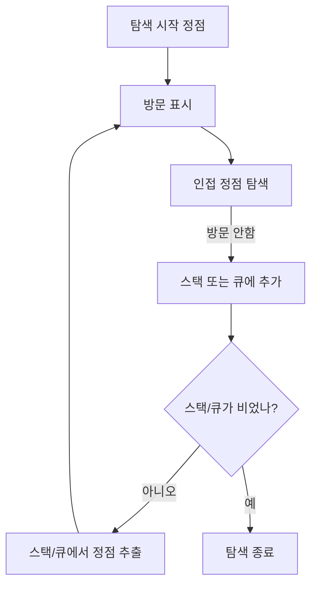

# 그래프 구현 및 표현 방법

## 1. 그래프 핵심 함수

* **정점 삽입 / 삭제**
* **간선 삽입 / 삭제**
* **공백 상태 확인 함수 (비어있는지 확인)**
* **인접 정점 리스트 반환**
* **그래프 할당 및 해제 함수**

---

## 2. 그래프 표현법

### 2.1 인접 행렬 (Adjacency Matrix)

* `n × n` 2차원 배열 사용
* 정점 i와 j가 연결되어 있으면 `matrix[i][j] = 1`, 아니면 `0`
* 자기 자신에 대한 간선은 일반적으로 `0` (대각선은 0)

예) 정점 0\~3의 인접 행렬 (무방향 그래프)

|   | 0 | 1 | 2 | 3 |
| - | - | - | - | - |
| 0 | 0 | 1 | 1 | 1 |
| 1 | 1 | 0 | 1 | 0 |
| 2 | 1 | 1 | 0 | 1 |
| 3 | 1 | 0 | 1 | 0 |

---

### 2.2 인접 리스트 (Adjacency List)

* 각 정점마다 연결된 정점 리스트를 연결 리스트(또는 동적 배열)로 관리
* 메모리 효율적, 간선이 적은 희소 그래프에 적합

예) 정점별 인접 리스트

| 정점 | 인접 정점 리스트        |
| -- | ---------------- |
| 0  | 1 → 2 → 3 → NULL |
| 1  | 0 → 2 → NULL     |
| 2  | 0 → 1 → 3 → NULL |
| 3  | 0 → 2 → NULL     |

---

# 그래프 탐색 (Graph Traversal)

## 1. 깊이 우선 탐색 (DFS: Depth-First Search)

* 한 방향으로 끝까지 탐색 후, 되돌아가 인접한 다른 경로 탐색
* 스택 또는 재귀 호출로 구현
* 사용 예: 미로 탈출, 경로 찾기

### DFS 예시

```
0
├─1
│ └─2
│   └─3
└─4
```

탐색 순서: 0 → 1 → 2 → 3 → 4

---

## 2. 너비 우선 탐색 (BFS: Breadth-First Search)

* 시작 정점과 가까운 정점부터 레벨 순서대로 탐색
* 큐(Queue) 자료구조 사용
* 사용 예: 최단 경로 탐색, 네트워크 전파

### BFS 예시

```
0
├─1
├─2
└─3
```

탐색 순서: 0 → 1 → 2 → 3

---

# 탐색 알고리즘 구현 개념



---

# 신장 트리 (Spanning Tree)

* 그래프 내 모든 정점을 포함하는 트리
* **조건**

  * 모든 정점 연결
  * 사이클 없음
  * 간선 수 = 정점 수 - 1

### 예시: 정점 3개 신장 트리

1. 간선 {0–1, 1–2}
2. 간선 {0–2, 1–2}
3. 간선 {0–1, 0–2}

각 경우 모두 사이클 없음, 2개의 간선 포함

---

# 구현 코드 예시 (C언어)

### 인접 행렬 그래프 초기화 및 간선 삽입

```c
#include <stdio.h>
#define MAX_VERTICES 4

int graph[MAX_VERTICES][MAX_VERTICES];

void init_graph() {
    for (int i = 0; i < MAX_VERTICES; i++)
        for (int j = 0; j < MAX_VERTICES; j++)
            graph[i][j] = 0;
}

void add_edge(int from, int to) {
    graph[from][to] = 1;
    graph[to][from] = 1; // 무방향 그래프인 경우
}

void print_graph() {
    for (int i = 0; i < MAX_VERTICES; i++) {
        printf("정점 %d: ", i);
        for (int j = 0; j < MAX_VERTICES; j++) {
            if (graph[i][j])
                printf("%d ", j);
        }
        printf("\n");
    }
}

int main() {
    init_graph();
    add_edge(0, 1);
    add_edge(0, 2);
    add_edge(1, 2);
    add_edge(2, 3);

    print_graph();
    return 0;
}
```

---

### 깊이 우선 탐색 (DFS)

```c
#include <stdio.h>
#define MAX_VERTICES 4

int graph[MAX_VERTICES][MAX_VERTICES];
int visited[MAX_VERTICES];

void dfs(int v) {
    visited[v] = 1;
    printf("%d ", v);
    for (int i = 0; i < MAX_VERTICES; i++) {
        if (graph[v][i] && !visited[i]) {
            dfs(i);
        }
    }
}

int main() {
    // 그래프 초기화 및 간선 삽입 코드 생략(위 참조)
    // 방문 배열 초기화
    for (int i = 0; i < MAX_VERTICES; i++)
        visited[i] = 0;

    dfs(0);
    return 0;
}
```

---

### 너비 우선 탐색 (BFS)

```c
#include <stdio.h>
#define MAX_VERTICES 4

int graph[MAX_VERTICES][MAX_VERTICES];
int visited[MAX_VERTICES];
int queue[MAX_VERTICES];
int front = 0, rear = 0;

void enqueue(int v) {
    queue[rear++] = v;
}

int dequeue() {
    return queue[front++];
}

int is_empty() {
    return front == rear;
}

void bfs(int start) {
    visited[start] = 1;
    enqueue(start);

    while (!is_empty()) {
        int v = dequeue();
        printf("%d ", v);
        for (int i = 0; i < MAX_VERTICES; i++) {
            if (graph[v][i] && !visited[i]) {
                visited[i] = 1;
                enqueue(i);
            }
        }
    }
}

int main() {
    // 그래프 초기화 및 간선 삽입 코드 생략(위 참조)
    for (int i = 0; i < MAX_VERTICES; i++)
        visited[i] = 0;

    bfs(0);
    return 0;
}
```

---

# 응용 사례

* **네트워크 경로 탐색:** 인터넷 라우팅, 최단 경로 계산
* **지도 및 내비게이션:** 도로망 경로 탐색, 교통 흐름 분석
* **프로세스 스케줄링:** 운영체제에서 자원 할당과 선후 관계 분석
* **전자 회로:** 회로 내 단자 연결성 확인
* **도시 계획 및 GIS:** 도시 인프라 연결망 분석

---